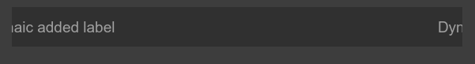
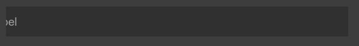
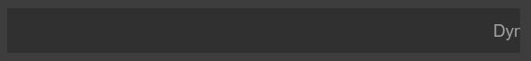

# qtScrollingText
Scrolling text widget demonstration for QT

The **ScrollingLabel** widget is based on a **QLabel** with **QPixmap** type content.

The **MainWidget** demo class shows a simple and intuitive interface for managing the **ScrollingLabel** widget.

Implemented only for single line of text moving from right to left.

Text can currently move in two modes:

  * SingleContinuous - the text at the right edge of the widget appears immediately after it disappears from the left edge.

  * SingleFullText - the text at the right edge of the widget appears only after it completely disappears from the left edge.

The speed of text movement can be adjusted by changing two parameters: **period** (*the time interval between pixel movements*) and **offset** (*the number of pixels per movement*).

